# What is this?
This a Powershell script for Windows that will download the latest ADB from the Official repositories and install it System-wide or User-Wide, this script will also install latest Google drivers also from from the Official repositories.

# Features:
Small - 8,98 kB
 Fast - it take seconds to install 
 ADB, Fastboot and also Drivers
 Easy to install - just run the script and the script will guide you
 Clean - ADB and Google Drivers from the Official repositories.

# Install process:
Click on the script and choose "link save as" and save the script   

 
Right click on the script and choose "run with Powershell"
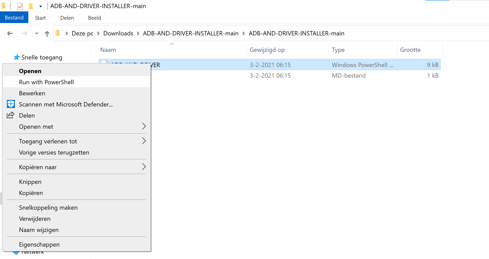
 
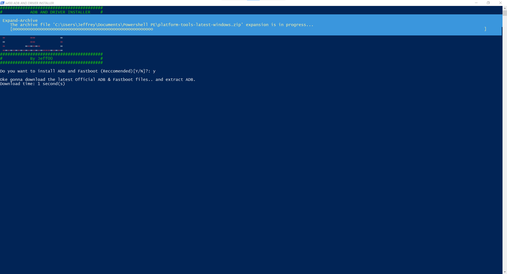
 
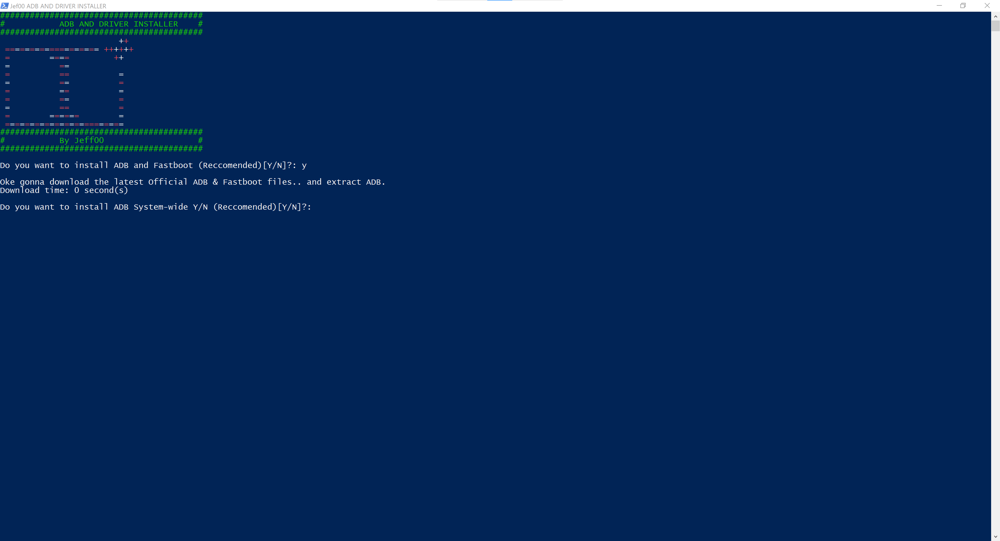
 
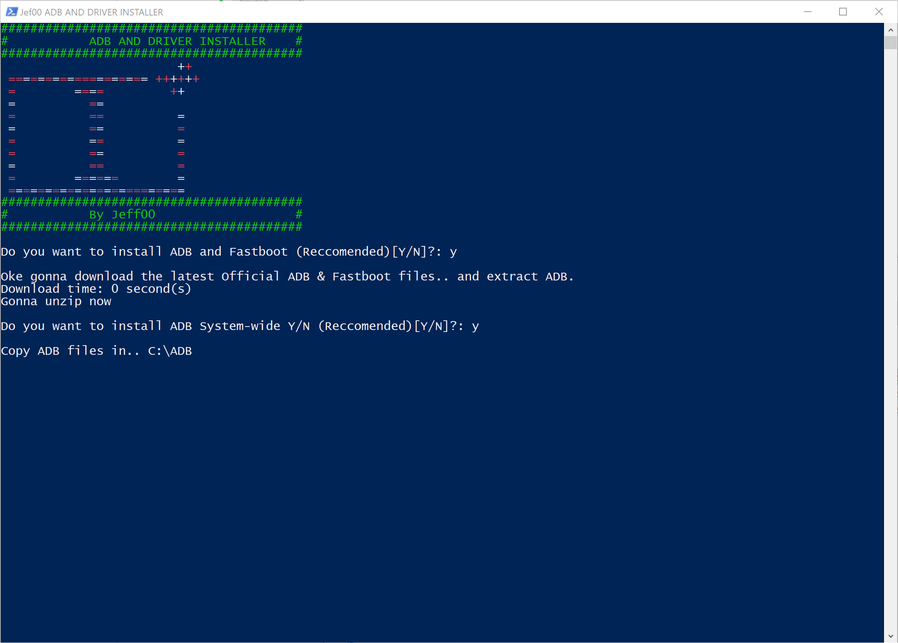
 
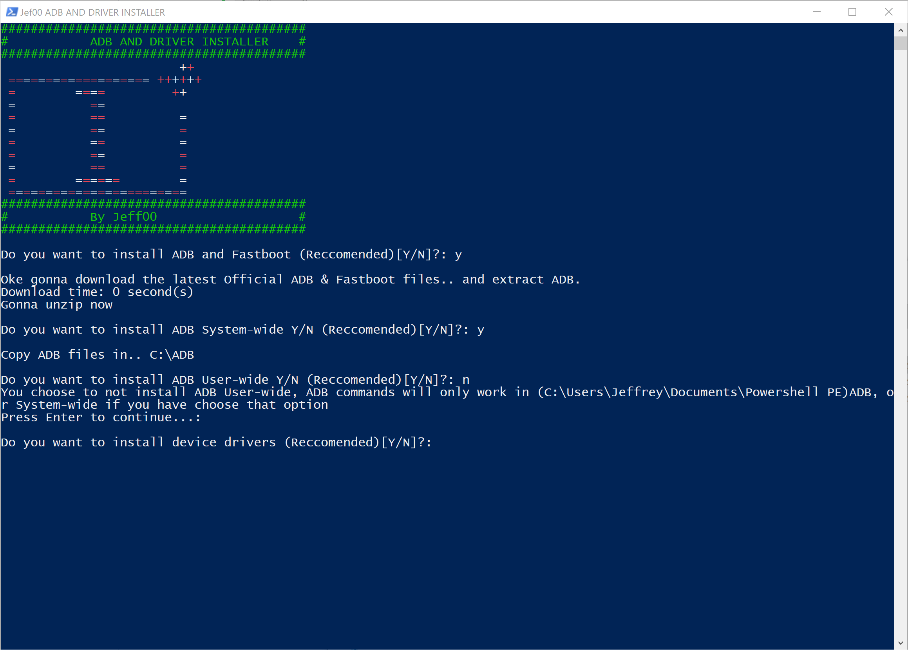
 

 1. Run the script it (Require administrator privileges)
 2. Press Y/Yes to install ADB and Fastboot or N/No to skip
 3. Press Y/Yes to install ADB system-wide or N/No for current user only
 4. Press Y/Yes to install Drivers or N/No to skip
 5. Continue Driver installation
 6. 15 seconds passed - finished!

# Notes:
System-wide: ADB and Fastboot are installed to HOMEDRIVE\ADB directory, and added system-wide path.  
HOMEDRIVE=C:\ so in case of the System-wide install option ADB will copy over to C:\ADB 
 
Current user only: ADB and Fastboot are installed to UserProfile\ADB directory, and added path for current user.
UserProfile=%SystemDrive%\Users\{username} so in case of the Userwide-wide install option ADB will copy over to C:\Users\username\ADB
 
CMD or Poweshell can use ADB and Fastboot from any directory. 
You can run the script from any directory unless you want to update ADB. Follow the steps from how to update if you want to update.

# Problems after driver installation?
Go to the device manager and right click on the android driver and choose update driver.  
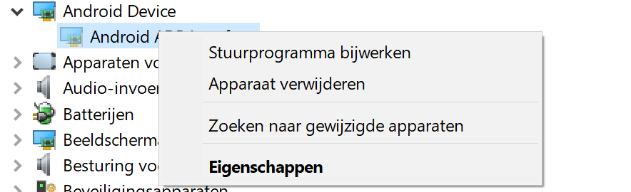
 

 Choose the second option. 
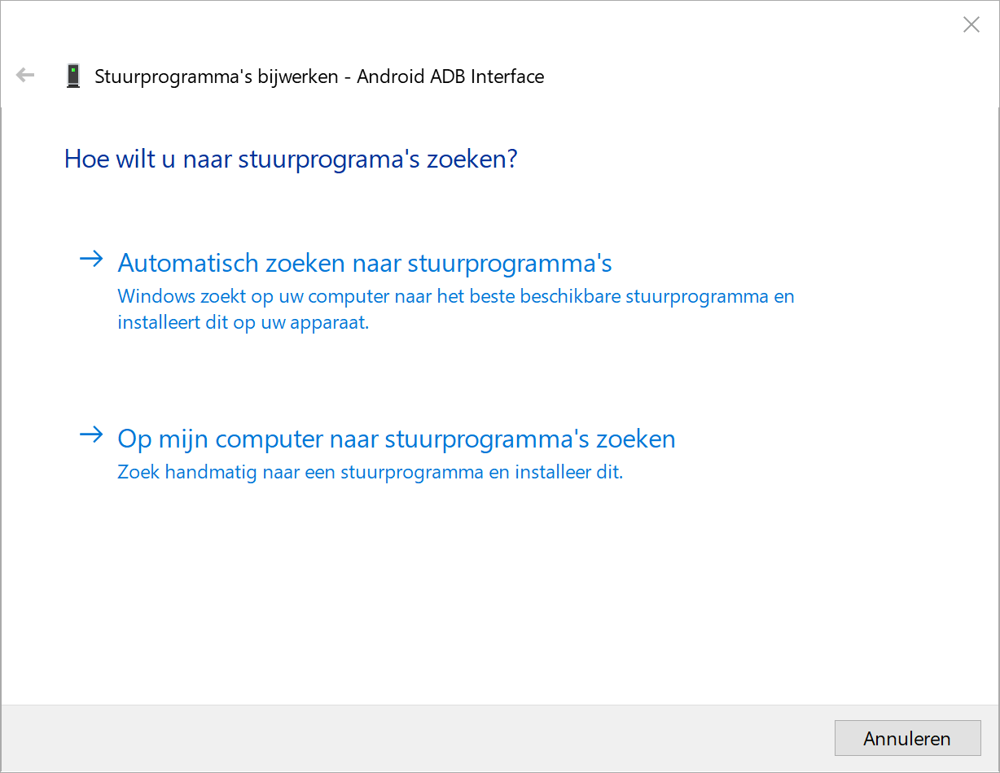

 Choose the second option again and click "Next". 
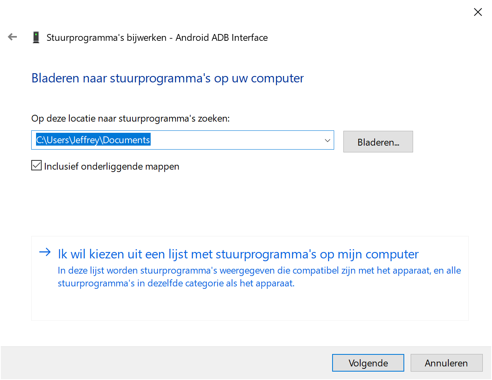

 Select the Android Device and click "Next". 

 Select Android ADB Interface and click "Next". 
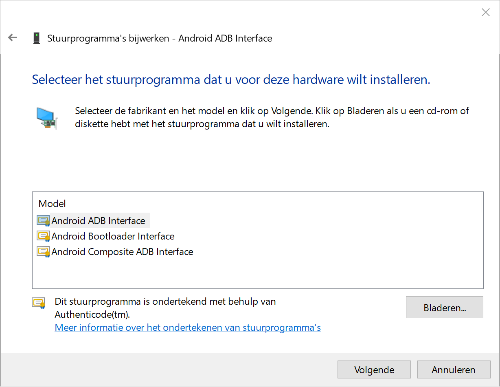

 Choose "yes" and click "Next". 
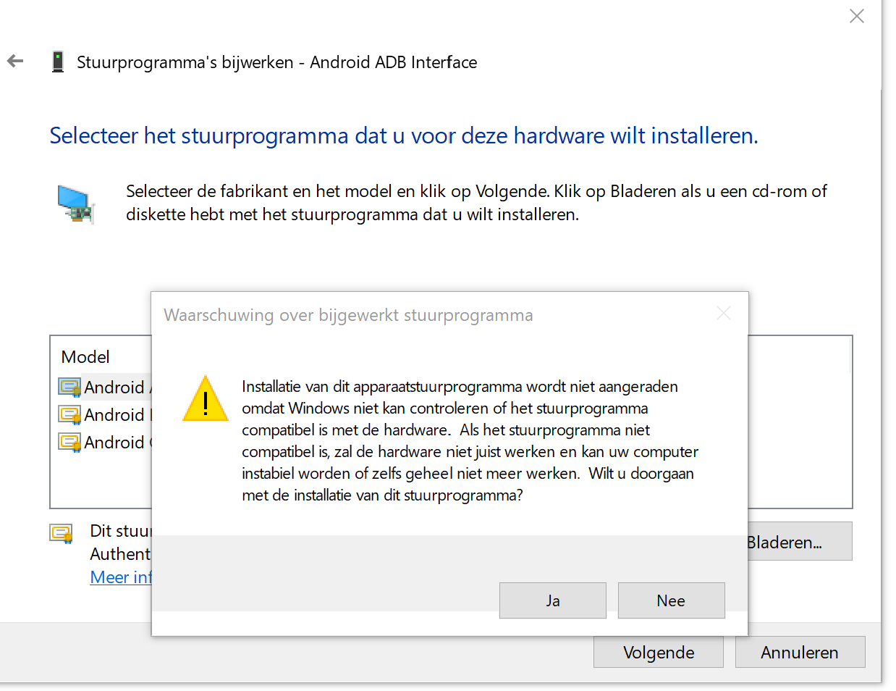

 Choose "Close" . 
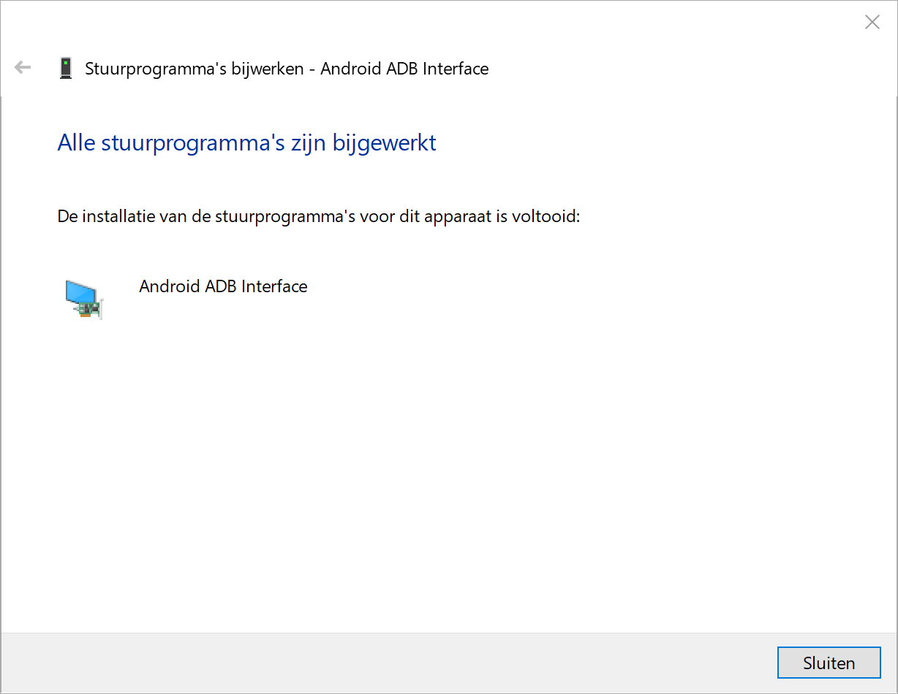

Now the driver will work!

# How to update?
If you want to update ADB when there is an new version of ADB. The update process depends how you install ADB, System-wide or User-Wide 
if you have installed System-wide place the script in C:\ and run the script until image blow and close the window.
When you have installed ADB User-wide place the script in %SystemDrive%\Users\{username} and run the script until image blow and close the window. 

 

## How to update drivers?
Rerun the tool and choose "no" until you were ask "Do you want to install device drivers" Choose "yes"

